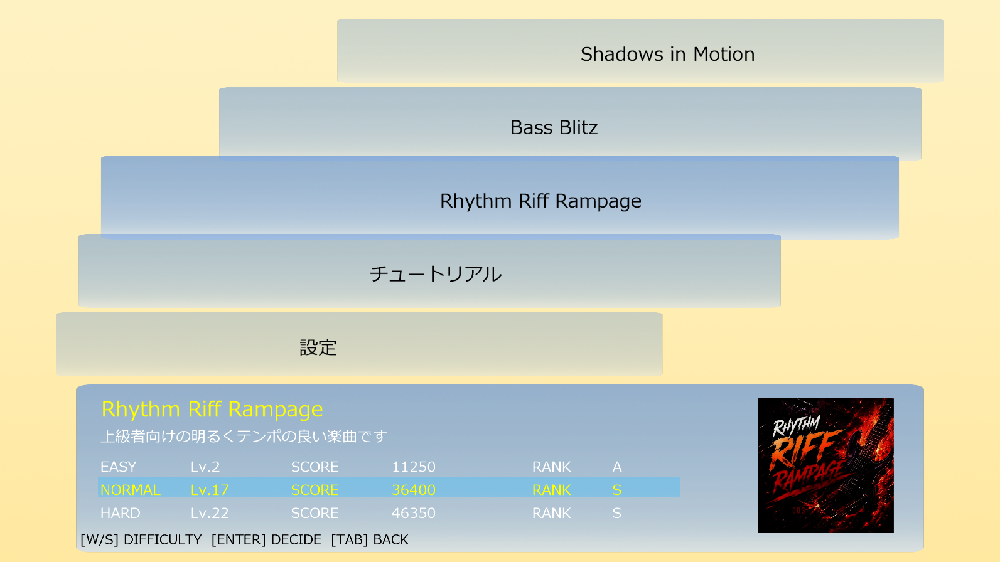
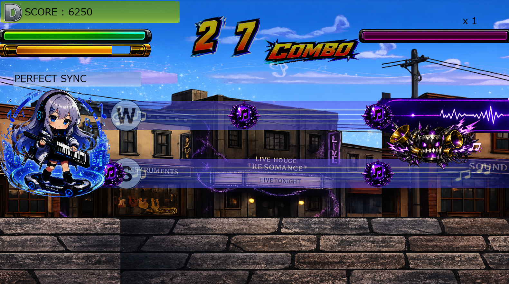
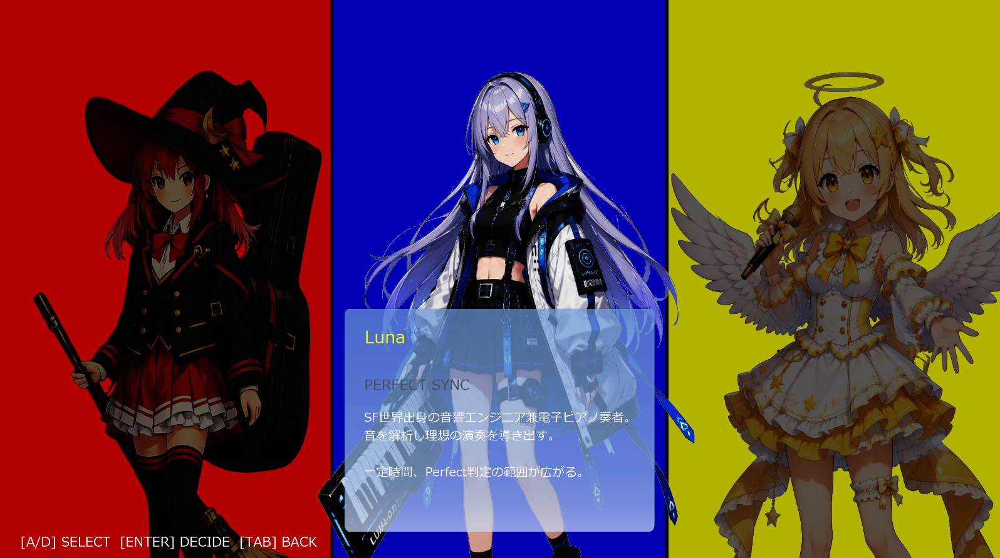
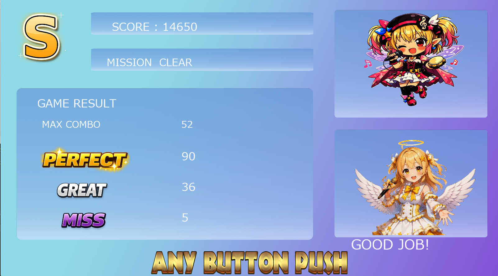

# RHYTHMIC WORLD TUNING

A multilingual rhythm game developed with C++ and DirectX 11.

音楽があふれる異世界を舞台に、不協和音を発生させる「ノイジー」を音楽の力で調律するリズムゲームです。

## Overview

プレイヤーは楽曲、難易度、キャラクターを選択し、上下2レーンを流れるノーツをタイミングよく入力します。

通常ノーツ、ロングノーツ、連打ノーツに対応しており、ノーツの入力と敵への攻撃を組み合わせたゲームシステムになっています。

## Screenshots

### Title Screen


### Music Select



### Gameplay



### Character Select



### Chart Editor


### Multilingual Support

日本語、英語、韓国語、中国語の4言語に対応しています。


### Result Screen



## Features

- 3曲、各3難易度の譜面
- 通常、長押し、連打の3種類のノーツ
- キャラクター選択システム
- キャラクターごとに異なるスキル
- 楽曲プレビュー再生
- スコア、コンボ、ランク、ミッション結果の表示
- キーボード、Xboxコントローラー、PlayStationコントローラー対応
- 日本語、英語、韓国語、中国語の切り替え
- CSVを利用した楽曲情報、譜面、多言語テキストの管理
- ゲーム内譜面エディットモード
- 音量、ノーツ速度、画面サイズなどのコンフィグ設定

## Character Skills

### Riff

攻撃力を強化するスキルを持つキャラクターです。

### Luna

一定時間、Perfect判定の範囲を拡大します。

### Melody

スコア獲得を補助するスキルを持つキャラクターです。

## Chart Editor

ゲーム内のエディットモードでは、楽曲を再生しながら譜面を編集できます。

主な機能は次のとおりです。

- タイムラインの移動
- 上下レーンの選択
- Normal、Long、Rapidノーツの配置
- ノーツの削除
- 楽曲の再生と停止
- CSV形式による譜面の保存と読み込み

## Controls

### Menu

#### Keyboard

- `W / S`: Select
- `A / D`: Change value or horizontal selection
- `Enter`: Confirm
- `Tab / Backspace`: Back

#### Xbox Controller

- Left Stick / D-Pad: Select
- `A`: Confirm
- `B`: Back

#### PlayStation Controller

- Left Stick / D-Pad: Select
- `Cross`: Confirm
- `Circle`: Back

### Gameplay

#### Keyboard

- `W`: Upper lane
- `S`: Lower lane

#### Xbox Controller

- `Y`: Upper lane
- `X`: Lower lane

#### PlayStation Controller

- `Triangle`: Upper lane
- `Square`: Lower lane

## Development Environment

- Language: C++
- Graphics API: DirectX 11
- IDE: Visual Studio
- Version Control: Git / GitHub Desktop
- Data Format: CSV

## Supported Languages

- Japanese
- English
- Korean
- Chinese

Song titles are displayed in English across all language settings.

## How to Build

1. Open the solution file in Visual Studio.
2. Select the appropriate build configuration.
3. Build the solution.
4. Place all required resources and runtime libraries in the expected directories.
5. Run the generated executable file.

The required external libraries and runtime files must be prepared before building the project.

## Manual

詳しいゲーム説明、操作方法、各画面の構成については、以下の説明書を参照してください。

[Open the game manual](docs/manual/rhythmic-world-tuning-manual.pdf)
```text
RHYTHMIC_WORLD_TUNING/
├─ docs/
│  ├─ manual/
│  └─ screenshots/
├─ README.md
└─ ...
```

## Credits

### Audio

- BGM and sound effects: MaouDamashii
- Sound effects: Sound Effect Lab
- Game music generation support: Loudly

### Images

Some visual assets were created with generative AI tools and edited or adjusted for use in this project.

### Development Support

Microsoft Copilot was used as development support for tasks such as code organization, naming improvements, refactoring suggestions and removal of magic numbers.

All generated output was reviewed, edited, integrated and tested by the developer.

## Author

Hibiki Sakuma

## Notice

This repository was created as a student game development project and portfolio work.

Unauthorized redistribution or commercial use of original game assets, characters, images and audio data is prohibited.
